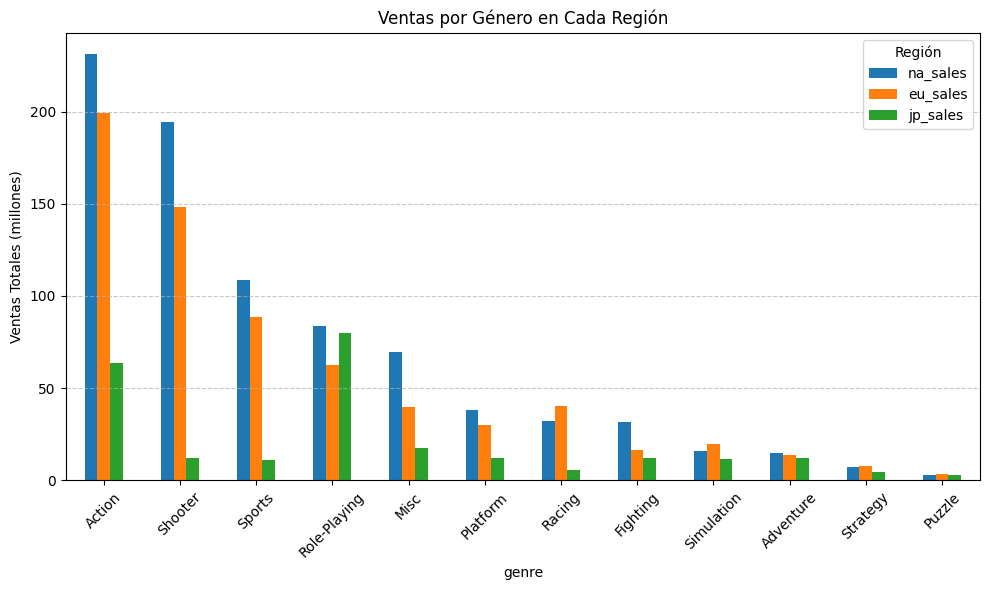
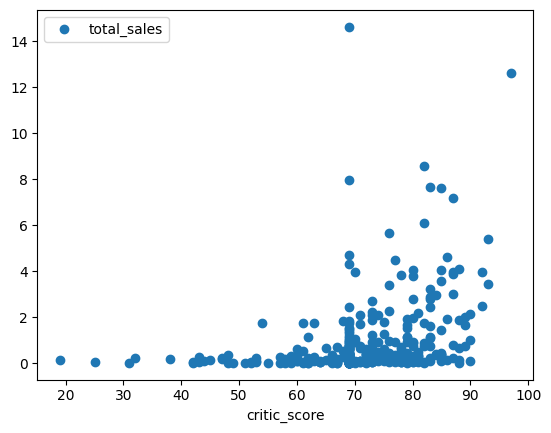

## Analisis de venta de videojuegos
Análisis de ventas de videojuegos por región, plataforma y género para identificar patrones clave, permitiendo a Ice detectar proyectos con alto potencial y diseñar campañas publicitarias efectivas. El estudio de las dinámicas de mercado en Norteamérica, Europa y Japón busca optimizar estrategias de marketing y maximizar el ROI en los lanzamientos más prometedores.

### herramientas y tipo de proyecto

### Puntos clave de investigación
Tendencias de plataformas: Distribución de ventas globales y variaciones regionales.
Preferencias de género: Popularidad comparativa en Norteamérica, Europa y Japón.
Impacto de reseñas: Relación entre puntuaciones (usuarios/críticos) y desempeño comercial.
Diferencias cualitativas: Calificaciones promedio por plataforma y género.

### Enfoque metodológico
Limpieza de datos: Eliminación de inconsistencia (datos faltantes/duplicados) y estandarización de formatos.
EDA: Identificación de patrones en plataformas/géneros y análisis de correlación reseñas-ventas.
Análisis regional: Contraste de preferencias entre mercados clave.
Validación estadística: Pruebas de hipótesis para comparar evaluaciones de usuarios.

### Hallazgos y acciones estratégicas
Preferencias regionales:
1. Occidente: Dominio de acción/disparos en Xbox/PlayStation.
2. Japón: Predominio de RPG en portátiles (3DS).
Influencia de reseñas:
1. Críticos: impactan ventas (r≈0.35)
2. usuarios: mínimo efecto.
La brecha comercial entre géneros sugiere que los juegos con narrativas inmersivas (RPG) o mecánicas competitivas (deportes/disparos) tienen mayor aceptación global.

## Resultados clave:
Xbox One y PC: calificaciones similares.
Acción vs. Deportes: diferencias significativas.

### Recomendaciones:
Priorizar PS4/Xbox One en campañas globales.
Localizar estrategias: RPG en Japón; acción/disparos en Occidente.

## Visualizaciones

**Análisis de ventas por género**
Tendencias destacadas:
- Géneros más vendidos: Acción, disparos (shooters), juegos de rol (RPG) y deportes lideran el mercado.
- Géneros con menor demanda: Rompecabezas y estrategia registran ventas significativamente más bajas.

**Relación entre críticas y desempeño comercial**
Se observa una correlación moderada (coeficiente ~0.4) entre las valoraciones de expertos y el volumen de ventas, lo que sugiere que:
Las reseñas profesionales influyen parcialmente en las decisiones de compra.
Los consumidores no basan su elección únicamente en este factor (otros elementos como franquicias, marketing o preferencias personales podrían tener mayor peso).

